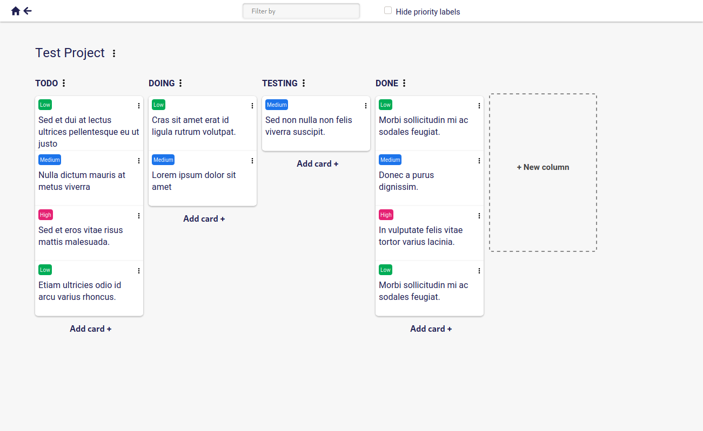

# Simple-Kanban.xyz

A web-application for creating kanban boards to manage projects.

## About

Fair to say this could be described as a bare-bones [trello](https://trello.com/)-clone.

The point of making this web application was for me to teach myself more about full-stack developement. 
But the site does work and you can totally use it. Just keep in mind that no warranty is provided.

Unlike other similar sites, Simple-Kanban requires no signing in to use. 
Authorization is done with a JSON Web Token, which is stored as a cookie.

Text is encrypted on the client side, so no essential information about your projects is ever stored in plain-text on the server.

## Stack

### Client

| React | Sass |
| :-: | :-: |
|  |  |

### Backend

| Node.js | Express.js | PostgreSQL |
| :-: | :-: | :-: |
|  |  |  |
